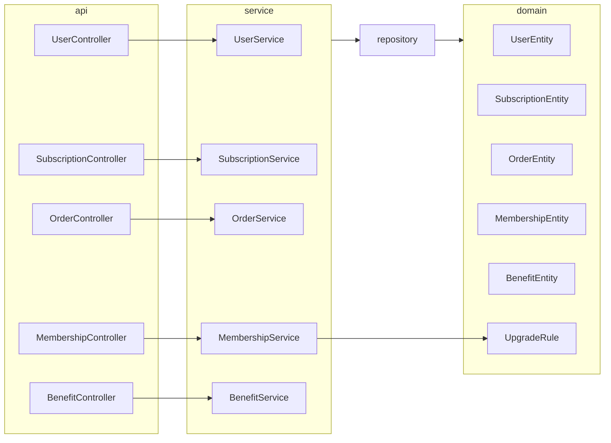
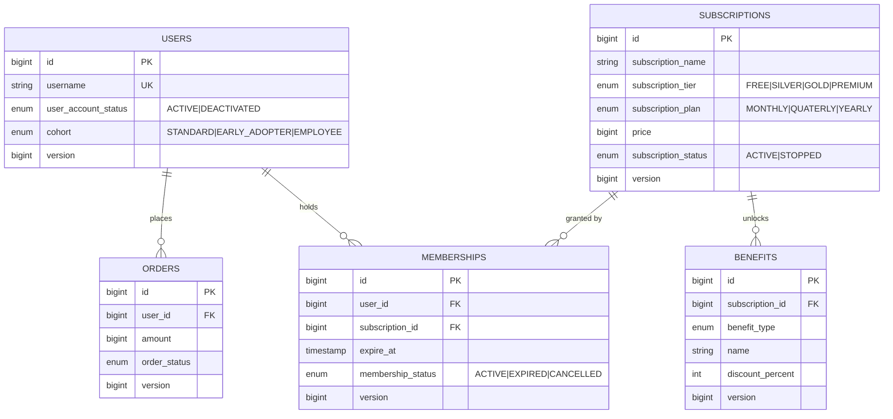
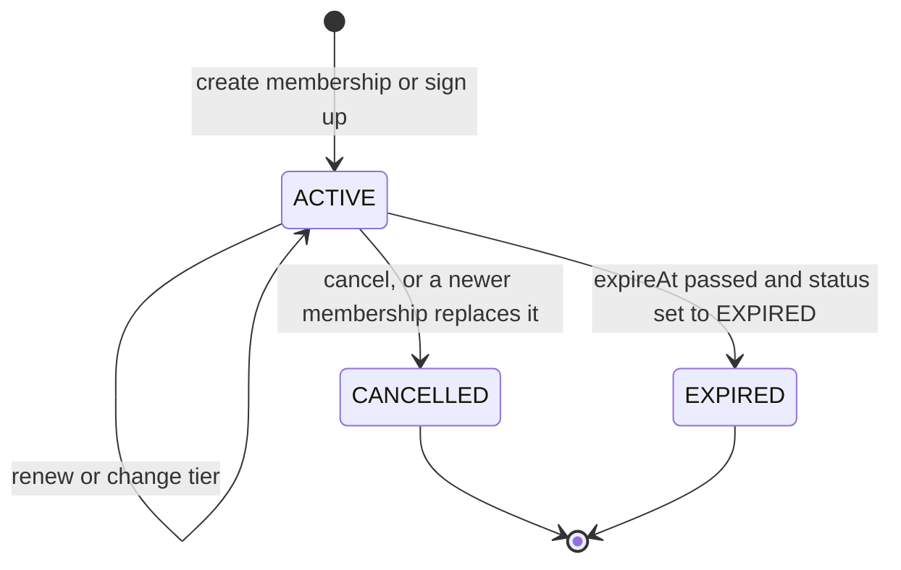
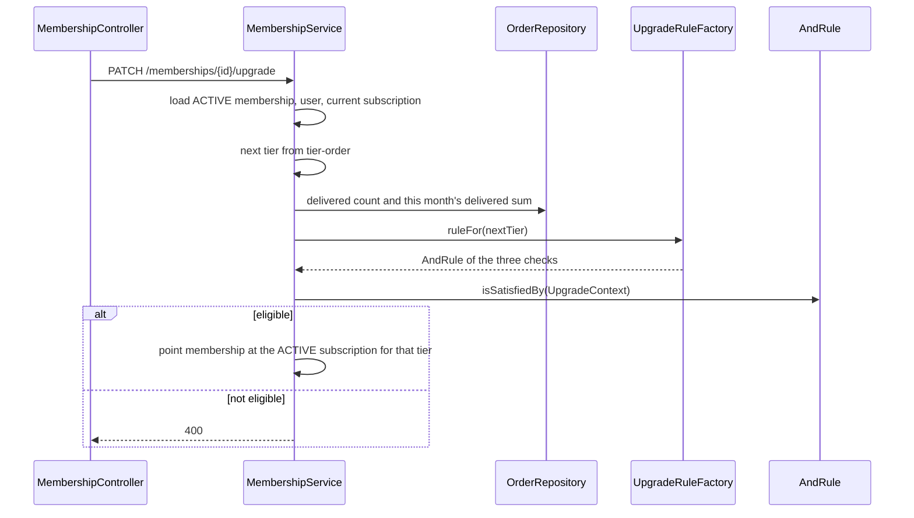

# Subscriptions app — Design Document

> Backend for a subscription membership program with configurable plans, tiers, and benefits,
> and tier changes driven by delivered-order activity and cohort.

- **Stack:** Java 17 · Spring Boot 4.1 · Spring Data JPA · PostgreSQL 16 · Flyway
- **Entry point:** `org.demo.com.subscriptionsapp.SubscriptionsAppApplication`
- **API:** `http://localhost:8080/api/v1` · **Postgres:** `localhost:5432` / `subscription_db`

---

## 1. Problem restatement & scope

| Requirement | Where it lives |
|---|---|
| Monthly / Quarterly / Yearly plans, priced per tier | `SubscriptionEntity` (`subscriptionPlan`, `subscriptionTier`, `price`) |
| Tiered benefits — free delivery, X% discount, exclusive deals, early access, priority support, coupons — **configurable** | `BenefitEntity` rows attached to a `subscriptionId`; `BenefitType` |
| List plans a caller can choose | `GET /api/v1/subscriptions` |
| Open a membership on a plan | `POST /api/v1/memberships` and, for a new user, the free membership created by `POST /api/v1/users` |
| Upgrade / downgrade / renew / cancel | `PATCH /api/v1/memberships/{id}/upgrade`, `/downGrade`, `/renew`, `/cancel` |
| Track current membership and expiry | `GET /api/v1/memberships` and `GET /api/v1/memberships/{id}` (`membershipStatus`, `expireAt`) |
| Tier movement by order count, monthly order value, and cohort | `UpgradeRule` specifications + `app.subscription.tier-rules` |
| Orders placed by a member | `POST /api/v1/orders` |
| Concurrency | Optimistic `@Version` on `BaseEntity` |

Out of scope: a payment provider, role-based ownership checks, checkout pricing, and automatic promotion after an order is saved. Upgrade and downgrade run only when those endpoints are called.

---

## 2. Architecture overview

**Layering**

- Controllers validate input and map HTTP status. They call services only.
- Services own the use-cases: existence checks, tier rules, and status changes.
- JPA entities stay in `domain.entity`. API types stay in `api.dto`. Converters copy between them.
- `UpgradeRule` implementations do not touch the database. `MembershipService` builds an `UpgradeContext` and asks the rule.

---

## 3. Domain model

### 3.1 Entities

| Entity | Responsibility | Key decisions |
|---|---|---|
| `BaseEntity` | `id`, `createdAt`, `updatedAt`, `@Version` | Shared by every table. Hibernate increments `version` on update. |
| `UserEntity` | Login name, account status, cohort | `username` is unique. New users are `ACTIVE` and `STANDARD`. Cohort is stored, not derived from orders. |
| `SubscriptionEntity` | One sellable plan: tier × billing period × price | All 12 combinations are seeded. `STOPPED` plans cannot be joined or renewed. |
| `OrderEntity` | A charge for one user | Created as `PENDING_PAYMENT`. Delivered orders are what tier rules count. |
| `MembershipEntity` | A user's current or past subscription | Creating a new membership cancels the user's previous rows. `expireAt` comes from the plan length, except the free membership issued at signup. |
| `BenefitEntity` | One configurable perk on a subscription | Type picks the kind of perk. `discountPercent` parameterises `DISCOUNT`. Higher tiers get more perks by having more rows, not by code branches. |

### 3.2 Membership lifecycle

Expiry is not applied by a scheduler. `expireAt` is stored, and benefit lookup ignores memberships that are already past that time. A status of `EXPIRED` is data, not a job.

Plan lengths used when a membership is created, renewed, or moved to another tier: monthly **30** days, quarterly **90** days, yearly **365** days. The free membership created with a user uses `app.subscription.default-free-tier-days` (36500).

---

## 4. Tier eligibility

### 4.1 Model

`tier-order` is `FREE → SILVER → GOLD → PREMIUM`. Upgrade moves one step up. Downgrade moves one step down.

Each tier has one rule set in `app.subscription.tier-rules`. All three checks must pass (`AndRule`):

| Check | Rule | Meaning |
|---|---|---|
| Order count | `MinimumOrderCountRule` | Count of `DELIVERED` orders is **greater than** `min-order-count` |
| Monthly value | `MonthlyOrderValueRule` | Sum of delivered `amount` in the current calendar month is **at least** `min-monthly-order-value` |
| Cohort | `CohortRule` | `users.cohort` is in the tier's `cohorts` list |

Seeded thresholds:

| Tier | Orders more than | Monthly value | Cohorts |
|---|---|---|---|
| FREE | -1 (any count passes) | 0 | `STANDARD`, `EARLY_ADOPTER`, `EMPLOYEE` |
| SILVER | 5 | 1000 | all three |
| GOLD | 15 | 5000 | `EARLY_ADOPTER`, `EMPLOYEE` |
| PREMIUM | 30 | 15000 | `EMPLOYEE` |

### 4.2 Evaluation

Downgrade uses the same rules on the **current** tier. The move happens only when those rules fail. A member who still qualifies stays put (**400**). The lowest tier cannot be downgraded. The highest tier cannot be upgraded.

A cohort is a label on the user (`STANDARD`, `EARLY_ADOPTER`, `EMPLOYEE`). Signup sets `STANDARD`. It is independent of purchase history, so Gold and Premium can be limited to named groups without changing order queries.

---

## 5. Benefits

A benefit is a row on a subscription, not a calculation at checkout. `GET /api/v1/benefits?userId=` walks **user → active, unexpired membership → subscription → benefits**.

| `BenefitType` | How it is configured |
|---|---|
| `FREE_DELIVERY` | Presence of the row |
| `DISCOUNT` | `discountPercent` from 0 to 100 |
| `EXCLUSIVE_DEALS`, `EARLY_ACCESS`, `PRIORITY_SUPPORT`, `EXCLUSIVE_COUPON` | `name` and `description` |

There is no cart or item catalogue. The list tells the caller which perks the member's current plan includes.

---

## 6. API surface

Base path `/api/v1`. Invalid bodies and refused business rules return **400**. Unknown ids return **404** (`NotFoundException`, message `Entity not found: {id}`). Creates return **201**. Benefit delete returns **204**.

List calls return a Spring page (`content`, `totalElements`, `totalPages`, `number`, `size`). `page` starts at 0. Omitted or zero `size` means 20. Rows are ordered by `id`.

| Method & path | Purpose | Notable responses |
|---|---|---|
| `POST /users` | Create user `{username}`; status `ACTIVE`, cohort `STANDARD`; free membership for `default-free-tier-days` | 201 · 400 duplicate username · 404 no active `FREE` subscription |
| `GET /users/{id}` | One user | 404 |
| `PATCH /users/{id}` | Set `userAccountStatus`. Moving to `DEACTIVATED` cancels memberships that are not `EXPIRED` and not past `expireAt` | 400 already deactivated |
| `GET /users` | List. Default status `ACTIVE`. Filters: `username` (contains), `userAccountStatus` | |
| `POST /subscriptions` | Create plan `{subscriptionName, subscriptionTier, subscriptionPlan, price}` as `ACTIVE` | 201 |
| `GET /subscriptions/{id}` | One subscription | 404 |
| `PATCH /subscriptions/{id}` | Update `price` and/or `subscriptionStatus` when present | |
| `GET /subscriptions` | List. Default status `ACTIVE`. Filters: `subscriptionName`, `subscriptionTier`, `subscriptionPlan`, `minPrice`, `maxPrice`, `subscriptionStatus` | |
| `POST /orders` | Create order `{userId, amount}` as `PENDING_PAYMENT` | 201 · 404 unknown user |
| `GET /orders/{id}` | One order | 404 |
| `PATCH /orders/{id}` | Set `orderStatus` | 400 user is `DEACTIVATED` |
| `GET /orders` | List. Default status `DELIVERED`. Filters: `userId`, `orderStatus` | |
| `POST /memberships` | Join `{userId, subscriptionId}`. Cancels that user's other memberships. `expireAt` from the plan | 400 deactivated user or `STOPPED` plan |
| `GET /memberships/{id}` | One membership | 404 |
| `PATCH /memberships/{id}/renew` | New `expireAt` from now and the current plan | 400 cancelled membership or stopped plan |
| `PATCH /memberships/{id}/upgrade` | Next tier when its rules pass | 400 not eligible, not active, or already highest |
| `PATCH /memberships/{id}/downGrade` | Previous tier when current rules fail | 400 still eligible, not active, or already lowest |
| `PATCH /memberships/{id}/cancel` | Status `CANCELLED` | 400 already cancelled |
| `GET /memberships` | List. Default status `ACTIVE`. Filters: `userId`, `subscriptionId`, `membershipStatus` | |
| `POST /benefits` | Create perk on `subscriptionId` | 201 · 404 unknown subscription |
| `GET /benefits/{id}` | One benefit | 404 |
| `PATCH /benefits/{id}` | Update type, name, description, `discountPercent` when present | 400 percent outside 0–100 |
| `DELETE /benefits/{id}` | Delete | 204 · 404 |
| `GET /benefits?userId=` | Perks for the user's active, unexpired memberships | 400 missing `userId` · 404 unknown user · empty page if none qualify |

`subscriptionPlan` values are `MONTHLY`, `QUATERLY`, `YEARLY` (the stored spelling). `orderStatus` values are `PENDING_PAYMENT`, `IN_TRANSIT`, `CONFIRMED`, `CANCELLED`, `DELIVERED`, `FAILED`.

---

## 7. Extensibility

| You want to… | Do this |
|---|---|
| Change how many orders or how much spend a tier needs | Edit `app.subscription.tier-rules` |
| Let another cohort into Gold or Premium | Add that cohort to the tier's `cohorts` list, and set it on the user |
| Add a perk to a plan | `POST /api/v1/benefits` for that `subscriptionId` |
| Add a perk kind | Add a `BenefitType` value and store rows of that type |
| Insert a tier between two existing ones | Put it in `tier-order` and add a `tier-rules` entry plus subscription rows |
| Change free-membership length | `app.subscription.default-free-tier-days` |

---

## 8. Operational notes

- **Schema:** Flyway `V1`–`V10` create tables. `V11`–`V14` seed five users, twelve subscriptions, thirteen orders, and six memberships.
- **Containers:** `docker compose up --build`. App on port 8080, Postgres on 5432. No volume: data disappears with the container.
- **Limits:** each container 0.5 CPU and 512 MB. Tomcat threads 5–20. Hikari pool size 5. JVM `-Xms256m -Xmx256m -Xss512k`.
- **Exercise the API:** `./demo.sh` against a fresh stack.

---

## 9. Trade-offs

| Decision | Alternative | Why this way |
|---|---|---|
| One subscription row per tier × plan | Separate plan and tier tables with a price matrix | The catalogue is twelve fixed products. A single row is what memberships and benefits point at. |
| Cohort stored on the user | Derive a cohort from signup date or order history | The requirement is membership of a named group, which order totals cannot express. |
| Upgrade and downgrade are explicit API calls | Promote automatically after each order | The caller decides when to move. Rules stay in `UpgradeRule` either way. |
| All three tier checks must pass | ANY-of criteria | A tier can still be opened to every cohort by listing all of them, while order gates stay mandatory. |
| Benefits are data, not applied to a cart | Price the cart inside this service | There is no item catalogue. The benefit list is what a storefront would read. |
| `@Version` only | Pessimistic row locks | Concurrent updates fail instead of overwriting each other. The conflict is not mapped to a dedicated HTTP status yet. |
